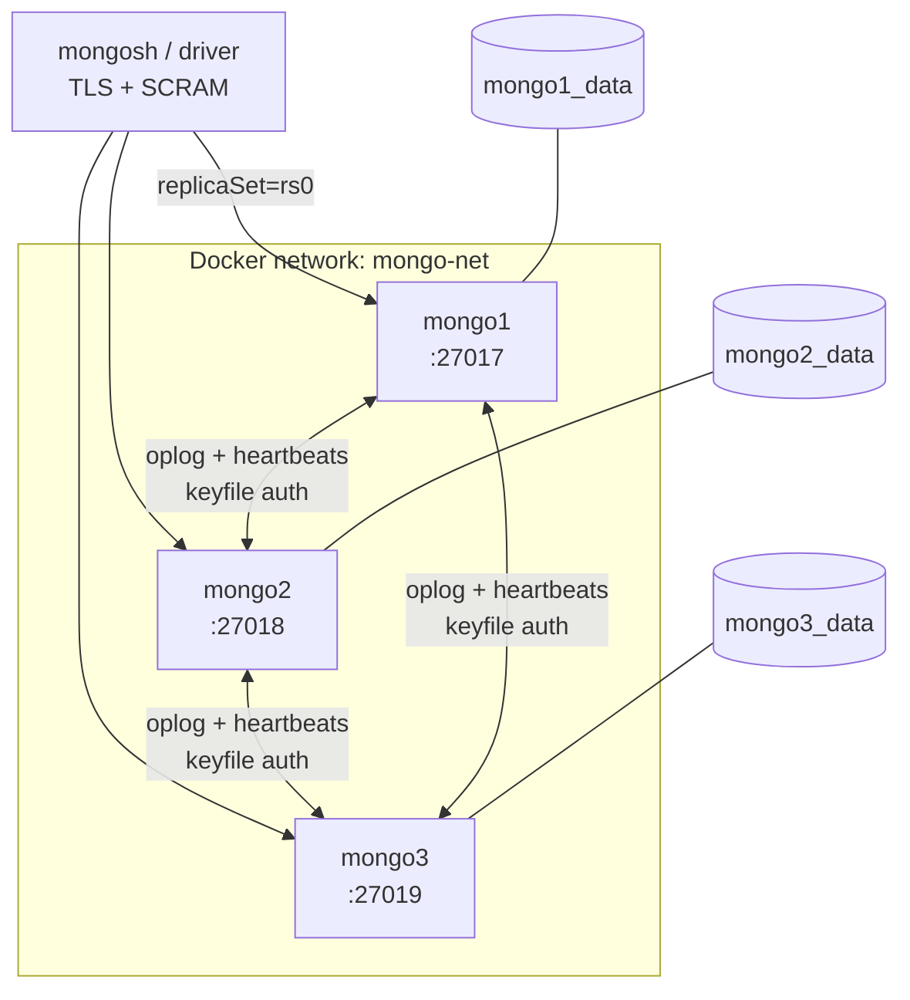

# mongo-ha-lab

[](https://github.com/juanmatruj/mongo-ha-lab/actions/workflows/ci.yml)

A MongoDB replica set lab provisioned entirely from code: private CA and TLS, keyfile internal authentication, least-privilege users, and a test suite that validates the result on every push.

Built as a database reliability engineering portfolio project. Every layer was deliberately broken and observed before being documented, and the design decisions — including the compromises — are recorded in [ADRs](docs/adr/).

---

## What this demonstrates

- A 3-node replica set with automatic failover, measured under both graceful shutdown and abrupt termination
- Internal cluster authentication, least-privilege RBAC and TLS with a private CA
- Provisioning declared in Ansible, with demonstrated idempotence
- Credentials injected at container bootstrap, leaving no unauthenticated window
- A test suite that asserts the cluster's actual state, including what must be denied
- Continuous validation: every push provisions the lab from nothing and tests it

---

## Architecture



Each node listens on its own port, published symmetrically to the host. See [ADR 0001](docs/adr/0001-symmetric-port-publishing.md) for why that matters and what broke before it did.

---

## Security layers

| Layer | Mechanism | Protects against |
|---|---|---|
| Internal authentication | Shared keyfile | A rogue process joining the replica set |
| Client authentication | SCRAM-SHA-256 | Unauthenticated access |
| Authorization | Per-purpose roles | Privilege escalation from a compromised client |
| Encryption in transit | TLS 1.2+, private CA | Traffic interception |
| Server identity | X.509 with SAN entries | Server impersonation |
| Secret handling | `ansible-vault`, gitleaks, push protection | Credentials reaching version control |

No layer is sufficient alone. See [ADR 0002](docs/adr/0002-keyfile-vs-x509.md) and [ADR 0003](docs/adr/0003-user-and-role-design.md).

### Users

| User | Role | Scope | Purpose |
|---|---|---|---|
| `admin` | `root` | `admin` | Cluster administration |
| `app_user` | `readWrite` | `labdb` | Application access, single database |
| `monitoring` | `clusterMonitor` | `admin` | Metrics collection (read-only) |
| `backup_user` | `backup` | `admin` | Backup operations |

Least privilege is asserted by the test suite: `app_user` is denied reads of `admin.system.users`, writes outside its database, and user creation.

---

## Requirements

- Docker Engine 20.10+
- Python 3.10+
- `mongosh` 2.x (optional; the Makefile uses `docker exec`)
- These entries in `/etc/hosts`:

```
127.0.0.1   mongo1 mongo2 mongo3
```

Required because replica set members advertise themselves by hostname, and clients reconnect using the addresses the cluster returns.

---

## Quick start

```bash
git clone git@github.com:juanmatruj/mongo-ha-lab.git
cd mongo-ha-lab

# 1. Python environment
python3 -m venv .venv && source .venv/bin/activate
pip install -r requirements-dev.txt

# 2. Ansible collections
cd ansible && ansible-galaxy collection install -r requirements.yml && cd ..

# 3. Credentials
ansible-vault create ansible/group_vars/all/vault.yml
```

Populate the vault with passwords generated by `openssl rand -base64 24`:

```yaml
vault_admin_pass: "..."
vault_monitor_pass: "..."
vault_backup_pass: "..."
vault_app_pass: "..."
```

```bash
# 4. Keyfile (the one step requiring root — see ADR 0005)
make keyfile

# 5. Provision
make up
```

Verify:

```bash
make status        # replica set member states
make users         # database users
make shell         # interactive mongosh session as admin
```

---

## Provisioning

Infrastructure is declared in Ansible. Cluster topology lives in the inventory as data, so adding a node is three lines rather than a duplicated service definition.

| Role | Responsibility |
|---|---|
| `certificates` | Private CA, per-node certificates with SAN entries, PEM bundles |
| `secrets` | Replica set keyfile; verifies the permissions MongoDB requires |
| `containers` | Network, volumes, containers, user bootstrap script |
| `replicaset` | `rs.initiate()`, primary election, state verification |

Credentials are injected during container initialisation rather than applied afterwards, so the database never accepts unauthenticated connections. Two alternatives were tried and rejected — see [ADR 0004](docs/adr/0004-credential-bootstrap.md).

Secrets are stored encrypted with `ansible-vault` and committed to the repository.

> Stages 1–2 used Docker Compose, superseded by Ansible in stage 3. The Compose definition remains in the git history.

### Idempotence

Provisioning from empty volumes, followed immediately by a second run:

```
PLAY RECAP
localhost : ok=23  changed=3  unreachable=0  failed=0  skipped=2

PLAY RECAP
localhost : ok=22  changed=0  unreachable=0  failed=0  skipped=3
```

The second run changes nothing. That is the acceptance criterion: a playbook that always reports changes cannot distinguish real drift from noise, and output nobody reads protects nothing.

---

## Validation

```bash
export MONGO_ADMIN_PASS='...'
export MONGO_APP_PASS='...'
make test
```

Thirteen tests assert the cluster's actual state rather than assuming the playbook's success implies it:

| Area | Assertions |
|---|---|
| Topology | One primary, two healthy secondaries, all members reachable |
| Durability | A `w:majority` write is acknowledged |
| Authentication | Unauthenticated connections rejected; non-TLS connections rejected |
| Users | Exactly the four expected users exist |
| Least privilege | `app_user` writes to `labdb`; is denied `admin.system.users`, other databases, and user creation — each verified by error code, not merely by "something failed" |
| Configuration | Keyfile mode and ownership match what MongoDB requires |

The negative assertions matter as much as the positive ones. An access control you have never seen deny anything is an assumption.

The suite itself was validated by breaking things: stopping two nodes, loosening keyfile permissions, and running a privilege-escalation test as `admin` to confirm it fails when it should.

### Continuous integration

Every push provisions the lab from nothing on a clean runner and runs the suite. `main` is protected: no direct pushes, and the check must pass before merging.

---

## Failover behaviour

| Scenario | Signal | Election reason | Write unavailability |
|---|---|---|---|
| `docker stop` | SIGTERM | `stepUpRequestSkipDryRun` | 11 ms |
| `docker kill` | SIGKILL | `electionTimeout` | seconds |

`stop` lets MongoDB catch the signal and step down deliberately. `kill` forces detection by heartbeat timeout. **Benchmarks that only test graceful shutdown do not describe any incident that can actually occur** — and the corollary is operational: run `rs.stepDown()` before planned maintenance to turn a tens-of-seconds outage into a millisecond one.

**Quorum loss.** With two of three nodes down, the survivor demotes itself to secondary and refuses writes. An isolated node cannot distinguish a dead peer from a network partition, so accepting writes would risk split-brain. MongoDB chooses consistency over write availability.

---

## Repository layout

```
├── ansible/
│   ├── site.yml              the playbook
│   ├── inventory/            cluster topology as data
│   ├── group_vars/all/       encrypted secrets
│   └── roles/                certificates, secrets, containers, replicaset
├── tests/                    pytest suite
├── docs/
│   ├── adr/                  architecture decision records
│   ├── reference/            tool reference guides
│   └── runbooks/             operational procedures
├── .github/workflows/        continuous integration
├── Makefile                  single entry point
└── requirements*.txt         pinned dependencies
```

`.env`, `certs/`, `secrets/` and `.initdb/` are excluded from version control. `ansible/group_vars/all/vault.yml` is committed because it is encrypted.

### Operations

```bash
make help          # list all targets
make preflight     # check environment preconditions
make check         # verify no secrets are tracked
make status        # replica set state
make logs NODE=mongo2
make down          # remove containers, keep data
make destroy       # remove everything, with confirmation
```

---

## Local setup for contributors

Git hooks live in `.git/hooks/` and are not versioned, so after cloning:

```bash
pre-commit install
pre-commit run --all-files
```

The hooks block commits containing private keys or credential patterns. They are a safety net against slips, not a substitute for judgement — detection works on known patterns and will not catch an ordinary-looking password.

---

## Known limitations

- Keyfile ownership requires root and is not automated. The playbook verifies it and fails with the exact commands to run ([ADR 0005](docs/adr/0005-unprivileged-provisioning.md)).
- Node private keys are world-readable on the host, and so is the bootstrap script while it exists. Acceptable on a single-user workstation, not on a shared host.
- All node certificates share `localhost` and `127.0.0.1` SAN entries, which weakens per-node identity verification. A consequence of co-locating nodes on one host.
- `docker-entrypoint-initdb.d` runs only on first initialisation; adding users later requires a separate procedure.
- Certificates expire in 825 days with no renewal automation.
- The keyfile cannot be rotated per node; it requires a coordinated restart of all members.
- Admin and application passwords exist in three places — the vault, the repository secrets and a local `.env` — and will diverge if rotated in only one. The vault is authoritative.

---

## License

MIT
