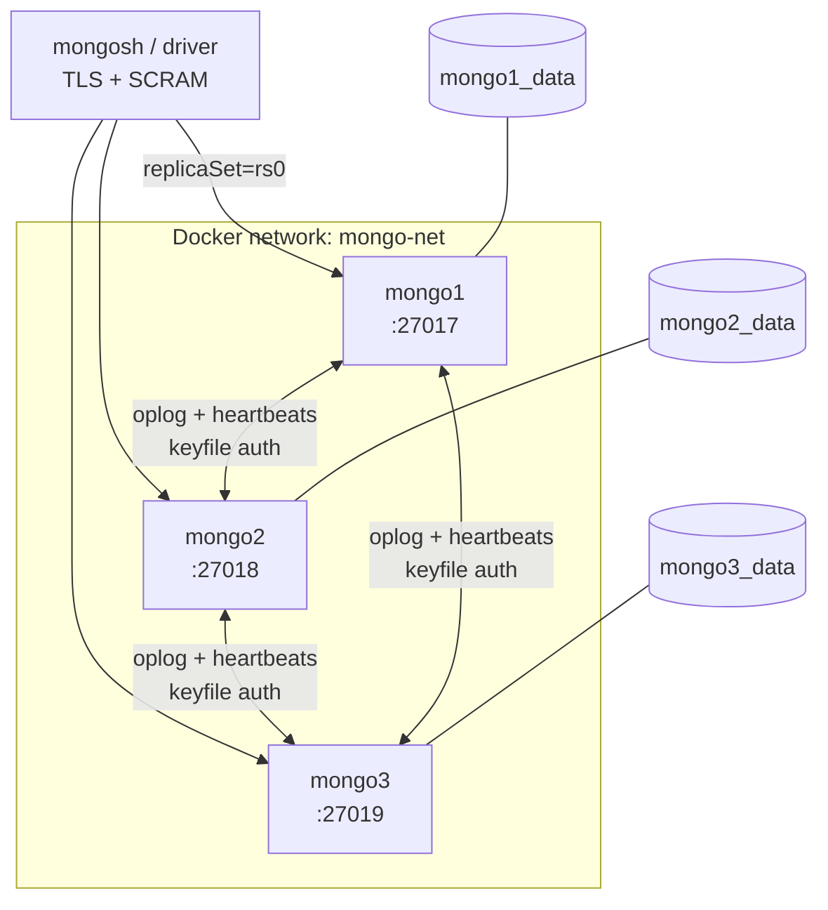

# mongo-ha-lab

Reproducible MongoDB replica set lab with keyfile authentication, least-privilege RBAC and TLS encryption, provisioned with Docker Compose.

Built as a database reliability engineering portfolio project: every layer is deliberately broken and observed before being documented.

---

## What this lab demonstrates

- A 3-node MongoDB replica set with automatic failover
- Internal cluster authentication with a shared keyfile
- Least-privilege role-based access control (four purpose-built users)
- TLS encryption in transit with a self-signed certificate authority
- Failover behaviour measured under both graceful shutdown and abrupt termination
- Quorum loss behaviour and its consistency guarantees

---

## Architecture



Each node listens on its own port, published symmetrically to the host. See [ADR 0001](docs/adr/0001-symmetric-port-publishing.md) for why.

---

## Security layers

| Layer | Mechanism | Protects against |
|---|---|---|
| Internal authentication | Shared keyfile | A rogue process joining the replica set |
| Client authentication | SCRAM-SHA-256 | Unauthenticated access |
| Authorization | Per-purpose roles | Privilege escalation from a compromised client |
| Encryption in transit | TLS 1.2+, private CA | Traffic interception |
| Server identity | X.509 with SAN | Server impersonation |
| Secret handling | `.gitignore`, gitleaks, push protection | Credential leaks into version control |

None of these is sufficient alone. See [ADR 0002](docs/adr/0002-keyfile-vs-x509.md) and [ADR 0003](docs/adr/0003-user-and-role-design.md).

---

## Requirements

- Docker Engine 20.10+ with the Compose plugin
- `mongosh` 2.x
- OpenSSL
- The following entries in `/etc/hosts`:

```
127.0.0.1   mongo1 mongo2 mongo3
```

Required because replica set members advertise themselves by hostname, and the client reconnects using the addresses the cluster returns.

---

## Quick start

```bash
git clone git@github.com:<user>/mongo-ha-lab.git
cd mongo-ha-lab

# 1. Secrets
cp .env.example .env
# edit .env with real values, then:
chmod 600 .env

# 2. Internal auth keyfile
mkdir -p secrets
openssl rand -base64 756 > secrets/keyfile
chmod 400 secrets/keyfile
sudo chown 999:999 secrets/keyfile

# 3. Certificate authority and node certificates
#    see docs/reference/ for the full procedure

# 4. Start
cd compose
docker compose up -d
docker compose ps
```

Connect:

```bash
mongosh "mongodb://mongo1:27017,mongo2:27018,mongo3:27019/?replicaSet=rs0&authSource=admin" \
  --tls --tlsCAFile ../certs/ca.crt \
  --username admin --authenticationDatabase admin
```

The password is prompted interactively on purpose: embedding it in the connection string leaks it into shell history and into `ps` output.

---

## Users and roles

| User | Role | Scope | Purpose |
|---|---|---|---|
| `admin` | `root` | `admin` | Cluster administration |
| `app_user` | `readWrite` | `labdb` | Application access, single database |
| `monitoring` | `clusterMonitor` | `admin` | Metrics collection (read-only) |
| `backup_user` | `backup` | `admin` | Backup operations |

Verified denials — `app_user` attempting to read `admin.system.users`, write outside `labdb`, and create a new user — are recorded in the project log.

---

## Repository layout

```
├── compose/            Docker Compose definition
├── docs/
│   ├── adr/            Architecture decision records
│   ├── reference/     Tool reference guides
│   └── runbooks/       Operational procedures
├── scripts/
├── tests/
├── .env.example        Credential template
└── .pre-commit-config.yaml
```

`.env`, `secrets/` and `certs/` are excluded from version control.

---

## Local setup for contributors

This repository uses [pre-commit](https://pre-commit.com/) hooks to prevent committing secrets. Git hooks live in `.git/hooks/` and are not versioned, so after cloning:

```bash
python3 -m venv .venv && source .venv/bin/activate
pip install pre-commit
pre-commit install
pre-commit run --all-files
```

---

## Operational notes

**Graceful shutdown vs. abrupt failure.** `docker compose stop` sends SIGTERM; MongoDB catches it and steps down deliberately, producing a sub-second failover. `docker compose kill` sends SIGKILL, forcing detection by heartbeat timeout. Benchmarks that only test graceful shutdown do not describe any incident that can actually occur.

**Quorum loss.** With two of three nodes down, the survivor demotes itself to secondary and refuses writes. An isolated node cannot distinguish a dead peer from a network partition, so accepting writes would risk split-brain. MongoDB chooses consistency over write availability.

**Diagnosis.** The client reports that something is unreachable; only the server explains why. Start with `docker compose ps -a` and `docker compose logs`, then connect directly to a node with `mongosh --port <port>`.

---

## Roadmap

- [x] Replica set with persistent volumes
- [x] Failover and quorum experiments
- [x] Keyfile internal authentication and RBAC
- [x] TLS with private CA
- [ ] Ansible provisioning with demonstrated idempotence
- [ ] Automated validation in CI

---

## License

MIT
